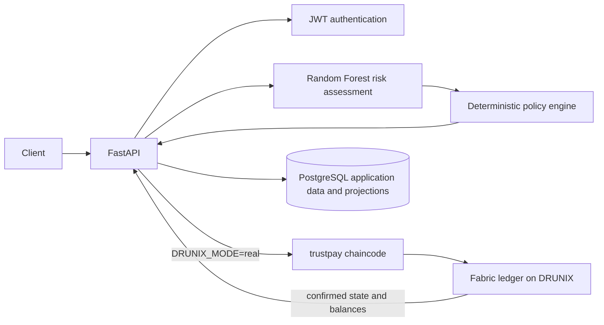

# ShariPay

**AI-Powered Trust Layer for Real-Time Payments**

ShariPay is a hackathon prototype that combines ML-assisted risk assessment, deterministic policy rules, a FastAPI application, and atomic payment settlement on a live DRUNIX / Hyperledger Fabric test network. It uses synthetic people, accounts, and INR values. It does not connect to UPI, NPCI production systems, banks, or payment gateways, and it does not move real funds.

The Fabric chaincode name remains lowercase `trustpay` for channel and ledger continuity. It is an integration identifier, not the product brand.

## 1. Problem

Payment systems need a way to evaluate risk and make concurrent settlement decisions without trusting a single application database to serialize competing spends.

## 2. Solution

ShariPay scores synthetic payment context with a Random Forest, applies deterministic policy rules, and submits the resulting decision to a Fabric chaincode. The ledger owns payment lifecycle state and account balances after an account has been initialized there.

## 3. Key innovation

For an approved payment, `SubmitPayment` creates the payment, records risk and policy data, debits the sender, credits the receiver, and appends four lifecycle-history snapshots in one Fabric transaction. Fabric read/write-set validation, not a PostgreSQL or Python lock, decides which conflicting spend can commit.

## 4. Architecture



PostgreSQL stores users, authentication records, beneficiaries, risk/policy records, audit events, and application projections. It is not the concurrency authority for ledger settlement. On first use, account initialization may import a simulated balance; later settlement reads the existing Fabric account balance.

## 5. End-to-end payment flow

1. A user registers and receives a synthetic INR account; a user can add another ShariPay user as a beneficiary.
2. `POST /api/v1/payments` validates ownership, status, currency, idempotency key, and the simulated account context.
3. The backend builds canonical model features, loads the committed model artifact, and stores the risk result separately from the policy decision.
4. The deterministic policy returns `APPROVE`, `VERIFY`, `HOLD`, or `REJECT`.
5. With `DRUNIX_MODE=real`, the backend submits one `SubmitPayment` invocation. The chaincode checks the ledger balance and performs the chosen transition atomically. With the default `DRUNIX_MODE=off`, no ledger transaction is sent and the application payment remains pending risk review.
6. The backend projects confirmed ledger status and balances only after the DRUNIX client reports commit and keyed ledger queries succeed.

## 6. AI/ML risk engine

The Random Forest is trained on fictional generated transactions. It accepts the canonical 15-feature schema in `ml/src/features.py`; identifiers and labels are excluded. Device/location indicators and prior fraud history currently use documented deterministic defaults because this prototype has no trusted device, location, or adjudicated fraud source. Model probability is a risk input, not a final decision.

## 7. Deterministic policy engine

The backend policy independently enforces hard rules such as invalid amounts, inactive parties/accounts, self-payment, insufficient simulated balance, inconsistent risk metadata, and repeated failures. LOW maps to `APPROVE`, MEDIUM to `VERIFY`, and HIGH to `HOLD`, subject to those hard rules. Policy code does not perform settlement.

## 8–9. DRUNIX and Fabric settlement

The deployed channel is `mychannel`; the chaincode identifier is `trustpay`. The verified live definition is version `1.9`, sequence `10`, package `trustpay_1.9:112b1c49559d05e217fe4babc05f6112cf73ffcf28d9c3834646b2d17ac94789`. It was committed in transaction `85c89946c40d54fff55fea0c62c4c433e23a71b253f46f0909f7372327c06f9b` (block 163, VALID). Both orgs approved and installed that package.

The live test-network uses synthetic identities and local X.509 administrator credentials. Keep private identity material outside source control. See [DRUNIX integration](docs/drunix-integration.md) for the verified lifecycle and transaction evidence. Do not run an upgrade command from older documentation without first querying the live sequence.

## 10–13. Settlement guarantees and lifecycle

The chaincode stores balances as integer minor units (paise). Exact transaction replay with an identical payload is idempotent; reusing a transaction ID with changed data is rejected. An insufficient ledger balance rejects the transaction without writing the payment or either account. Fabric MVCC protects concurrent writes to the same sender-account key. The state machine and guards are documented in [transaction-state-machine.md](docs/transaction-state-machine.md).

## 14. Tech stack

- Go, Hyperledger Fabric Contract API, and the NPCI DRUNIX test network
- Python, FastAPI, SQLAlchemy, Alembic, PostgreSQL, and JWT authentication
- Python ML stack: scikit-learn, pandas, NumPy, and joblib

## 15. Repository structure

```text
trustpay/
	backend/       FastAPI service, migrations, and API tests
	chaincode/     Fabric payment contract and Go tests
	docs/          Architecture, lifecycle, and integration evidence
	frontend/      No web application is implemented in this repository
	ml/            Synthetic data generation, training, prediction, and tests
```

The adjacent `drunix/` directory contains the DRUNIX/Fabric checkout and test-network tooling used by this workspace.

## 16. Local setup

Prerequisites: Go 1.23 or newer, Python with the pinned project dependencies available, and Docker for PostgreSQL. The live DRUNIX test network is a separate prerequisite only for ledger mode.

```bash
cd trustpay/backend
python -m venv .venv
source .venv/bin/activate
python -m pip install -r requirements.txt
cp .env.example .env
docker compose up -d postgres
python -m alembic upgrade head
uvicorn app.main:app --reload
```

On Windows PowerShell, activate with `.venv\Scripts\Activate.ps1`. The supplied environment values are development-only; set a fresh random `JWT_SECRET` before exposing the service. DRUNIX mode defaults to off. Enable `DRUNIX_MODE=real` only in a trusted local environment with the already-running network and protected admin credentials configured.

## 17. Tests

```bash
cd trustpay/chaincode/trustpay
go test -count=1 ./...
go vet ./...

cd ../../backend
python -m pytest -q
python -m pytest tests/test_drunix_integration.py -q

cd ../ml
python -m pytest -q
```

There is no frontend package manifest or frontend build/test command. Backend unit/integration tests do not substitute for live Fabric transaction tests.

## 18. Example chaincode payment

The direct chaincode invocation is `SubmitPayment(transactionID, senderID, receiverID, senderAccountID, receiverAccountID, amountMinor, senderInitialBalanceMinor, receiverInitialBalanceMinor, currency, riskScore, riskLevel, policyDecision)`. For example, the synthetic data `demo-001`, `sender-demo`, `receiver-demo`, `account-s-demo`, `account-r-demo`, `1200`, `10000`, `500`, `INR`, `0.12`, `LOW`, `APPROVE` represents a 1,200-paise payment. Use the test-network wrapper only with the existing authorized local identity.

## 19. Security considerations

Never commit `.env` files, JWT secrets, passwords, private keys, or generated network identities. The committed ML model is a required inference artifact; generated datasets and local credentials are not. DRUNIX administrator credentials are operator-only and must not be exposed through the API or browser. This repository’s test credentials are not production credentials.

## 20. Known limitations

- No web frontend is implemented; `frontend/` is only an empty placeholder.
- No UPI/NPCI production integration, bank connectivity, real funds, or production fraud adjudication exists.
- `GetAllPayments` can fail response-schema validation on legacy ledger records missing newer account/minor-amount fields. The backend demo uses keyed payment, account, and history queries; this is documented rather than forcing another lifecycle upgrade.
- Simulated PostgreSQL balances may need controlled reconciliation with existing ledger accounts before a wider rollout.

## 21. Hackathon team

Team and member names were not provided in this repository. Add the official team details before submitting the project to a judging portal.

## Verified live evidence (2026-09-30)

- Basic payment: VALID in block 164; status `COMPLETED`; sender 10,000 → 8,800 and receiver 500 → 1,700 minor units; four expected history entries.
- Exact replay: VALID in block 166; balances unchanged and history remained four entries.
- Same ID with changed payload: rejected. Insufficient balance: rejected without ledger writes.
- Concurrent double spend: block 170 contained one VALID transaction and one `MVCC_READ_CONFLICT` (code 11). A 7,000-minor-unit spend from 10,000 committed once; final sender balance was 3,000.
- Concurrent lifecycle mutation: block 177 contained one VALID approval and one `MVCC_READ_CONFLICT` (code 11); final payment state was `APPROVED`.
- Chaincode: tests passed; `go vet` passed. Backend: 63 passed, 1 skipped. DRUNIX integration tests: 18 passed.